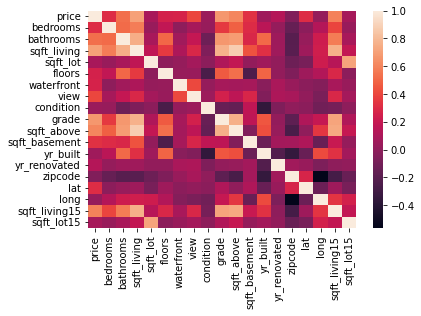
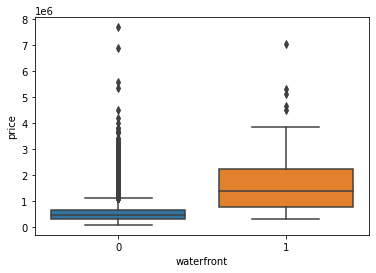
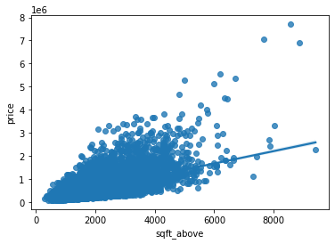
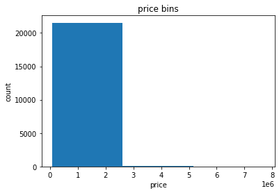

```python
import pandas as pd
import matplotlib.pyplot as plt
import numpy as np
import seaborn as sns
from sklearn.pipeline import Pipeline
from sklearn.preprocessing import StandardScaler,PolynomialFeatures
from sklearn.linear_model import LinearRegression, Ridge
from sklearn.model_selection import cross_val_score, train_test_split
from scipy import stats
%matplotlib inline
```

# Dataset: House Sales in King County, USA

This dataset contains house sale prices for King County, which includes Seattle. It includes homes sold between May 2014 and May 2015.


| Variable      | Description                                                                                                 |
| ------------- | ----------------------------------------------------------------------------------------------------------- |
| id            | A notation for a house                                                                                      |
| date          | Date house was sold                                                                                         |
| price         | Price is prediction target                                                                                  |
| bedrooms      | Number of bedrooms                                                                                          |
| bathrooms     | Number of bathrooms                                                                                         |
| sqft_living   | Square footage of the home                                                                                  |
| sqft_lot      | Square footage of the lot                                                                                   |
| floors        | Total floors (levels) in house                                                                              |
| waterfront    | House which has a view to a waterfront                                                                      |
| view          | Has been viewed                                                                                             |
| condition     | How good the condition is overall                                                                           |
| grade         | overall grade given to the housing unit, based on King County grading system                                |
| sqft_above    | Square footage of house apart from basement                                                                 |
| sqft_basement | Square footage of the basement                                                                              |
| yr_built      | Built Year                                                                                                  |
| yr_renovated  | Year when house was renovated                                                                               |
| zipcode       | Zip code                                                                                                    |
| lat           | Latitude coordinate                                                                                         |
| long          | Longitude coordinate                                                                                        |
| sqft_living15 | Living room area in 2015(implies-- some renovations) This might or might not have affected the lotsize area |
| sqft_lot15    | LotSize area in 2015(implies-- some renovations)                                                            |


```python
# download the data set
file_name='https://cf-courses-data.s3.us.cloud-object-storage.appdomain.cloud/IBMDeveloperSkillsNetwork-DA0101EN-SkillsNetwork/labs/FinalModule_Coursera/data/kc_house_data_NaN.csv'
df=pd.read_csv(file_name) # or df=pd.read_csv("./kc_house_data_NaN.csv")
df.describe()
```


<div>
<style scoped>
    .dataframe tbody tr th:only-of-type {
        vertical-align: middle;
    }

    .dataframe tbody tr th {
        vertical-align: top;
    }

    .dataframe thead th {
        text-align: right;
    }
</style>
<table border="1" class="dataframe">
  <thead>
    <tr style="text-align: right;">
      <th></th>
      <th>Unnamed: 0</th>
      <th>id</th>
      <th>price</th>
      <th>bedrooms</th>
      <th>bathrooms</th>
      <th>sqft_living</th>
      <th>sqft_lot</th>
      <th>floors</th>
      <th>waterfront</th>
      <th>view</th>
      <th>...</th>
      <th>grade</th>
      <th>sqft_above</th>
      <th>sqft_basement</th>
      <th>yr_built</th>
      <th>yr_renovated</th>
      <th>zipcode</th>
      <th>lat</th>
      <th>long</th>
      <th>sqft_living15</th>
      <th>sqft_lot15</th>
    </tr>
  </thead>
  <tbody>
    <tr>
      <th>count</th>
      <td>21613.00000</td>
      <td>2.161300e+04</td>
      <td>2.161300e+04</td>
      <td>21600.000000</td>
      <td>21603.000000</td>
      <td>21613.000000</td>
      <td>2.161300e+04</td>
      <td>21613.000000</td>
      <td>21613.000000</td>
      <td>21613.000000</td>
      <td>...</td>
      <td>21613.000000</td>
      <td>21613.000000</td>
      <td>21613.000000</td>
      <td>21613.000000</td>
      <td>21613.000000</td>
      <td>21613.000000</td>
      <td>21613.000000</td>
      <td>21613.000000</td>
      <td>21613.000000</td>
      <td>21613.000000</td>
    </tr>
    <tr>
      <th>mean</th>
      <td>10806.00000</td>
      <td>4.580302e+09</td>
      <td>5.400881e+05</td>
      <td>3.372870</td>
      <td>2.115736</td>
      <td>2079.899736</td>
      <td>1.510697e+04</td>
      <td>1.494309</td>
      <td>0.007542</td>
      <td>0.234303</td>
      <td>...</td>
      <td>7.656873</td>
      <td>1788.390691</td>
      <td>291.509045</td>
      <td>1971.005136</td>
      <td>84.402258</td>
      <td>98077.939805</td>
      <td>47.560053</td>
      <td>-122.213896</td>
      <td>1986.552492</td>
      <td>12768.455652</td>
    </tr>
    <tr>
      <th>std</th>
      <td>6239.28002</td>
      <td>2.876566e+09</td>
      <td>3.671272e+05</td>
      <td>0.926657</td>
      <td>0.768996</td>
      <td>918.440897</td>
      <td>4.142051e+04</td>
      <td>0.539989</td>
      <td>0.086517</td>
      <td>0.766318</td>
      <td>...</td>
      <td>1.175459</td>
      <td>828.090978</td>
      <td>442.575043</td>
      <td>29.373411</td>
      <td>401.679240</td>
      <td>53.505026</td>
      <td>0.138564</td>
      <td>0.140828</td>
      <td>685.391304</td>
      <td>27304.179631</td>
    </tr>
    <tr>
      <th>min</th>
      <td>0.00000</td>
      <td>1.000102e+06</td>
      <td>7.500000e+04</td>
      <td>1.000000</td>
      <td>0.500000</td>
      <td>290.000000</td>
      <td>5.200000e+02</td>
      <td>1.000000</td>
      <td>0.000000</td>
      <td>0.000000</td>
      <td>...</td>
      <td>1.000000</td>
      <td>290.000000</td>
      <td>0.000000</td>
      <td>1900.000000</td>
      <td>0.000000</td>
      <td>98001.000000</td>
      <td>47.155900</td>
      <td>-122.519000</td>
      <td>399.000000</td>
      <td>651.000000</td>
    </tr>
    <tr>
      <th>25%</th>
      <td>5403.00000</td>
      <td>2.123049e+09</td>
      <td>3.219500e+05</td>
      <td>3.000000</td>
      <td>1.750000</td>
      <td>1427.000000</td>
      <td>5.040000e+03</td>
      <td>1.000000</td>
      <td>0.000000</td>
      <td>0.000000</td>
      <td>...</td>
      <td>7.000000</td>
      <td>1190.000000</td>
      <td>0.000000</td>
      <td>1951.000000</td>
      <td>0.000000</td>
      <td>98033.000000</td>
      <td>47.471000</td>
      <td>-122.328000</td>
      <td>1490.000000</td>
      <td>5100.000000</td>
    </tr>
    <tr>
      <th>50%</th>
      <td>10806.00000</td>
      <td>3.904930e+09</td>
      <td>4.500000e+05</td>
      <td>3.000000</td>
      <td>2.250000</td>
      <td>1910.000000</td>
      <td>7.618000e+03</td>
      <td>1.500000</td>
      <td>0.000000</td>
      <td>0.000000</td>
      <td>...</td>
      <td>7.000000</td>
      <td>1560.000000</td>
      <td>0.000000</td>
      <td>1975.000000</td>
      <td>0.000000</td>
      <td>98065.000000</td>
      <td>47.571800</td>
      <td>-122.230000</td>
      <td>1840.000000</td>
      <td>7620.000000</td>
    </tr>
    <tr>
      <th>75%</th>
      <td>16209.00000</td>
      <td>7.308900e+09</td>
      <td>6.450000e+05</td>
      <td>4.000000</td>
      <td>2.500000</td>
      <td>2550.000000</td>
      <td>1.068800e+04</td>
      <td>2.000000</td>
      <td>0.000000</td>
      <td>0.000000</td>
      <td>...</td>
      <td>8.000000</td>
      <td>2210.000000</td>
      <td>560.000000</td>
      <td>1997.000000</td>
      <td>0.000000</td>
      <td>98118.000000</td>
      <td>47.678000</td>
      <td>-122.125000</td>
      <td>2360.000000</td>
      <td>10083.000000</td>
    </tr>
    <tr>
      <th>max</th>
      <td>21612.00000</td>
      <td>9.900000e+09</td>
      <td>7.700000e+06</td>
      <td>33.000000</td>
      <td>8.000000</td>
      <td>13540.000000</td>
      <td>1.651359e+06</td>
      <td>3.500000</td>
      <td>1.000000</td>
      <td>4.000000</td>
      <td>...</td>
      <td>13.000000</td>
      <td>9410.000000</td>
      <td>4820.000000</td>
      <td>2015.000000</td>
      <td>2015.000000</td>
      <td>98199.000000</td>
      <td>47.777600</td>
      <td>-121.315000</td>
      <td>6210.000000</td>
      <td>871200.000000</td>
    </tr>
  </tbody>
</table>
<p>8 rows × 21 columns</p>
</div>


```python
df.head(5)
```


<div>
<style scoped>
    .dataframe tbody tr th:only-of-type {
        vertical-align: middle;
    }

    .dataframe tbody tr th {
        vertical-align: top;
    }

    .dataframe thead th {
        text-align: right;
    }
</style>
<table border="1" class="dataframe">
  <thead>
    <tr style="text-align: right;">
      <th></th>
      <th>Unnamed: 0</th>
      <th>id</th>
      <th>date</th>
      <th>price</th>
      <th>bedrooms</th>
      <th>bathrooms</th>
      <th>sqft_living</th>
      <th>sqft_lot</th>
      <th>floors</th>
      <th>waterfront</th>
      <th>...</th>
      <th>grade</th>
      <th>sqft_above</th>
      <th>sqft_basement</th>
      <th>yr_built</th>
      <th>yr_renovated</th>
      <th>zipcode</th>
      <th>lat</th>
      <th>long</th>
      <th>sqft_living15</th>
      <th>sqft_lot15</th>
    </tr>
  </thead>
  <tbody>
    <tr>
      <th>0</th>
      <td>0</td>
      <td>7129300520</td>
      <td>20141013T000000</td>
      <td>221900.0</td>
      <td>3.0</td>
      <td>1.00</td>
      <td>1180</td>
      <td>5650</td>
      <td>1.0</td>
      <td>0</td>
      <td>...</td>
      <td>7</td>
      <td>1180</td>
      <td>0</td>
      <td>1955</td>
      <td>0</td>
      <td>98178</td>
      <td>47.5112</td>
      <td>-122.257</td>
      <td>1340</td>
      <td>5650</td>
    </tr>
    <tr>
      <th>1</th>
      <td>1</td>
      <td>6414100192</td>
      <td>20141209T000000</td>
      <td>538000.0</td>
      <td>3.0</td>
      <td>2.25</td>
      <td>2570</td>
      <td>7242</td>
      <td>2.0</td>
      <td>0</td>
      <td>...</td>
      <td>7</td>
      <td>2170</td>
      <td>400</td>
      <td>1951</td>
      <td>1991</td>
      <td>98125</td>
      <td>47.7210</td>
      <td>-122.319</td>
      <td>1690</td>
      <td>7639</td>
    </tr>
    <tr>
      <th>2</th>
      <td>2</td>
      <td>5631500400</td>
      <td>20150225T000000</td>
      <td>180000.0</td>
      <td>2.0</td>
      <td>1.00</td>
      <td>770</td>
      <td>10000</td>
      <td>1.0</td>
      <td>0</td>
      <td>...</td>
      <td>6</td>
      <td>770</td>
      <td>0</td>
      <td>1933</td>
      <td>0</td>
      <td>98028</td>
      <td>47.7379</td>
      <td>-122.233</td>
      <td>2720</td>
      <td>8062</td>
    </tr>
    <tr>
      <th>3</th>
      <td>3</td>
      <td>2487200875</td>
      <td>20141209T000000</td>
      <td>604000.0</td>
      <td>4.0</td>
      <td>3.00</td>
      <td>1960</td>
      <td>5000</td>
      <td>1.0</td>
      <td>0</td>
      <td>...</td>
      <td>7</td>
      <td>1050</td>
      <td>910</td>
      <td>1965</td>
      <td>0</td>
      <td>98136</td>
      <td>47.5208</td>
      <td>-122.393</td>
      <td>1360</td>
      <td>5000</td>
    </tr>
    <tr>
      <th>4</th>
      <td>4</td>
      <td>1954400510</td>
      <td>20150218T000000</td>
      <td>510000.0</td>
      <td>3.0</td>
      <td>2.00</td>
      <td>1680</td>
      <td>8080</td>
      <td>1.0</td>
      <td>0</td>
      <td>...</td>
      <td>8</td>
      <td>1680</td>
      <td>0</td>
      <td>1987</td>
      <td>0</td>
      <td>98074</td>
      <td>47.6168</td>
      <td>-122.045</td>
      <td>1800</td>
      <td>7503</td>
    </tr>
  </tbody>
</table>
<p>5 rows × 22 columns</p>
</div>


# Data Wrangling

Here, we can get rid of "id", "Unnamed: 0" , "date" columns, since these data are not considered as independent data on which the output (="price") depends. Then, we would like to find missing data in our dataset and replace them with mean value of regarding column.


```python
df.drop(["id", "Unnamed: 0","date"],axis=1,inplace=True)
missing_values=df.isnull().sum()
print(missing_values)
```

    price             0
    bedrooms         13
    bathrooms        10
    sqft_living       0
    sqft_lot          0
    floors            0
    waterfront        0
    view              0
    condition         0
    grade             0
    sqft_above        0
    sqft_basement     0
    yr_built          0
    yr_renovated      0
    zipcode           0
    lat               0
    long              0
    sqft_living15     0
    sqft_lot15        0
    dtype: int64
    


```python
mean=df['bedrooms'].mean()
df['bedrooms'].replace(np.nan,mean, inplace=True)
```


```python
mean=df['bathrooms'].mean()
df['bathrooms'].replace(np.nan,mean, inplace=True)
```

# Exploratory Data Analysis

Now, we can dig deeper into our model, and get more familiar with it.

We can select our features based on the correlation between those features and our output.


```python
print(df.corr()['price'].sort_values())
sns.heatmap(df.corr())
```

    zipcode         -0.053203
    long             0.021626
    condition        0.036362
    yr_built         0.054012
    sqft_lot15       0.082447
    sqft_lot         0.089661
    yr_renovated     0.126434
    floors           0.256794
    waterfront       0.266369
    lat              0.307003
    bedrooms         0.308797
    sqft_basement    0.323816
    view             0.397293
    bathrooms        0.525738
    sqft_living15    0.585379
    sqft_above       0.605567
    grade            0.667434
    sqft_living      0.702035
    price            1.000000
    Name: price, dtype: float64
    


    <AxesSubplot:>


    

    


```python
pearson_coef, p_value = stats.pearsonr(df['sqft_living'], df['price'])
print("The Pearson Correlation Coefficient is", pearson_coef, " with a P-value of P =", p_value)  
```

    The Pearson Correlation Coefficient is 0.7020350546117989  with a P-value of P = 0.0
    


```python
sns.boxplot(x=df["waterfront"],y=df[ "price"])
```


    <AxesSubplot:xlabel='waterfront', ylabel='price'>


    

    


```python
sns.regplot(x=df['sqft_above'],y=df["price"])
```


    <AxesSubplot:xlabel='sqft_above', ylabel='price'>


    

    


```python
df['bedrooms'].value_counts().to_frame()
```


<div>
<style scoped>
    .dataframe tbody tr th:only-of-type {
        vertical-align: middle;
    }

    .dataframe tbody tr th {
        vertical-align: top;
    }

    .dataframe thead th {
        text-align: right;
    }
</style>
<table border="1" class="dataframe">
  <thead>
    <tr style="text-align: right;">
      <th></th>
      <th>bedrooms</th>
    </tr>
  </thead>
  <tbody>
    <tr>
      <th>3.00000</th>
      <td>9824</td>
    </tr>
    <tr>
      <th>4.00000</th>
      <td>6882</td>
    </tr>
    <tr>
      <th>2.00000</th>
      <td>2760</td>
    </tr>
    <tr>
      <th>5.00000</th>
      <td>1601</td>
    </tr>
    <tr>
      <th>6.00000</th>
      <td>272</td>
    </tr>
    <tr>
      <th>1.00000</th>
      <td>199</td>
    </tr>
    <tr>
      <th>7.00000</th>
      <td>38</td>
    </tr>
    <tr>
      <th>3.37287</th>
      <td>13</td>
    </tr>
    <tr>
      <th>8.00000</th>
      <td>13</td>
    </tr>
    <tr>
      <th>9.00000</th>
      <td>6</td>
    </tr>
    <tr>
      <th>10.00000</th>
      <td>3</td>
    </tr>
    <tr>
      <th>11.00000</th>
      <td>1</td>
    </tr>
    <tr>
      <th>33.00000</th>
      <td>1</td>
    </tr>
  </tbody>
</table>
</div>


```python
grouped = df[['floors','grade','price']].groupby(['floors','grade'],as_index=False).mean()
grouped
```


<div>
<style scoped>
    .dataframe tbody tr th:only-of-type {
        vertical-align: middle;
    }

    .dataframe tbody tr th {
        vertical-align: top;
    }

    .dataframe thead th {
        text-align: right;
    }
</style>
<table border="1" class="dataframe">
  <thead>
    <tr style="text-align: right;">
      <th></th>
      <th>floors</th>
      <th>grade</th>
      <th>price</th>
    </tr>
  </thead>
  <tbody>
    <tr>
      <th>0</th>
      <td>1.0</td>
      <td>1</td>
      <td>1.420000e+05</td>
    </tr>
    <tr>
      <th>1</th>
      <td>1.0</td>
      <td>3</td>
      <td>2.056667e+05</td>
    </tr>
    <tr>
      <th>2</th>
      <td>1.0</td>
      <td>4</td>
      <td>2.161870e+05</td>
    </tr>
    <tr>
      <th>3</th>
      <td>1.0</td>
      <td>5</td>
      <td>2.444255e+05</td>
    </tr>
    <tr>
      <th>4</th>
      <td>1.0</td>
      <td>6</td>
      <td>2.944114e+05</td>
    </tr>
    <tr>
      <th>5</th>
      <td>1.0</td>
      <td>7</td>
      <td>3.905749e+05</td>
    </tr>
    <tr>
      <th>6</th>
      <td>1.0</td>
      <td>8</td>
      <td>5.527914e+05</td>
    </tr>
    <tr>
      <th>7</th>
      <td>1.0</td>
      <td>9</td>
      <td>8.564284e+05</td>
    </tr>
    <tr>
      <th>8</th>
      <td>1.0</td>
      <td>10</td>
      <td>1.161105e+06</td>
    </tr>
    <tr>
      <th>9</th>
      <td>1.0</td>
      <td>11</td>
      <td>1.602596e+06</td>
    </tr>
    <tr>
      <th>10</th>
      <td>1.0</td>
      <td>12</td>
      <td>2.168568e+06</td>
    </tr>
    <tr>
      <th>11</th>
      <td>1.0</td>
      <td>13</td>
      <td>3.070000e+06</td>
    </tr>
    <tr>
      <th>12</th>
      <td>1.5</td>
      <td>4</td>
      <td>1.900000e+05</td>
    </tr>
    <tr>
      <th>13</th>
      <td>1.5</td>
      <td>5</td>
      <td>2.703643e+05</td>
    </tr>
    <tr>
      <th>14</th>
      <td>1.5</td>
      <td>6</td>
      <td>3.415263e+05</td>
    </tr>
    <tr>
      <th>15</th>
      <td>1.5</td>
      <td>7</td>
      <td>5.038906e+05</td>
    </tr>
    <tr>
      <th>16</th>
      <td>1.5</td>
      <td>8</td>
      <td>6.967818e+05</td>
    </tr>
    <tr>
      <th>17</th>
      <td>1.5</td>
      <td>9</td>
      <td>9.506678e+05</td>
    </tr>
    <tr>
      <th>18</th>
      <td>1.5</td>
      <td>10</td>
      <td>1.271419e+06</td>
    </tr>
    <tr>
      <th>19</th>
      <td>1.5</td>
      <td>11</td>
      <td>1.767682e+06</td>
    </tr>
    <tr>
      <th>20</th>
      <td>2.0</td>
      <td>5</td>
      <td>2.475000e+05</td>
    </tr>
    <tr>
      <th>21</th>
      <td>2.0</td>
      <td>6</td>
      <td>3.025907e+05</td>
    </tr>
    <tr>
      <th>22</th>
      <td>2.0</td>
      <td>7</td>
      <td>3.869629e+05</td>
    </tr>
    <tr>
      <th>23</th>
      <td>2.0</td>
      <td>8</td>
      <td>5.191035e+05</td>
    </tr>
    <tr>
      <th>24</th>
      <td>2.0</td>
      <td>9</td>
      <td>7.401725e+05</td>
    </tr>
    <tr>
      <th>25</th>
      <td>2.0</td>
      <td>10</td>
      <td>1.033278e+06</td>
    </tr>
    <tr>
      <th>26</th>
      <td>2.0</td>
      <td>11</td>
      <td>1.457650e+06</td>
    </tr>
    <tr>
      <th>27</th>
      <td>2.0</td>
      <td>12</td>
      <td>2.174635e+06</td>
    </tr>
    <tr>
      <th>28</th>
      <td>2.0</td>
      <td>13</td>
      <td>3.588250e+06</td>
    </tr>
    <tr>
      <th>29</th>
      <td>2.5</td>
      <td>6</td>
      <td>3.612500e+05</td>
    </tr>
    <tr>
      <th>30</th>
      <td>2.5</td>
      <td>7</td>
      <td>5.166133e+05</td>
    </tr>
    <tr>
      <th>31</th>
      <td>2.5</td>
      <td>8</td>
      <td>6.437994e+05</td>
    </tr>
    <tr>
      <th>32</th>
      <td>2.5</td>
      <td>9</td>
      <td>9.401765e+05</td>
    </tr>
    <tr>
      <th>33</th>
      <td>2.5</td>
      <td>10</td>
      <td>1.537927e+06</td>
    </tr>
    <tr>
      <th>34</th>
      <td>2.5</td>
      <td>11</td>
      <td>1.913893e+06</td>
    </tr>
    <tr>
      <th>35</th>
      <td>2.5</td>
      <td>12</td>
      <td>2.357500e+06</td>
    </tr>
    <tr>
      <th>36</th>
      <td>2.5</td>
      <td>13</td>
      <td>4.459667e+06</td>
    </tr>
    <tr>
      <th>37</th>
      <td>3.0</td>
      <td>7</td>
      <td>3.739474e+05</td>
    </tr>
    <tr>
      <th>38</th>
      <td>3.0</td>
      <td>8</td>
      <td>4.954491e+05</td>
    </tr>
    <tr>
      <th>39</th>
      <td>3.0</td>
      <td>9</td>
      <td>7.879448e+05</td>
    </tr>
    <tr>
      <th>40</th>
      <td>3.0</td>
      <td>10</td>
      <td>1.195031e+06</td>
    </tr>
    <tr>
      <th>41</th>
      <td>3.0</td>
      <td>11</td>
      <td>1.511269e+06</td>
    </tr>
    <tr>
      <th>42</th>
      <td>3.0</td>
      <td>12</td>
      <td>2.191750e+06</td>
    </tr>
    <tr>
      <th>43</th>
      <td>3.5</td>
      <td>7</td>
      <td>1.095000e+06</td>
    </tr>
    <tr>
      <th>44</th>
      <td>3.5</td>
      <td>8</td>
      <td>5.119167e+05</td>
    </tr>
    <tr>
      <th>45</th>
      <td>3.5</td>
      <td>12</td>
      <td>3.300000e+06</td>
    </tr>
  </tbody>
</table>
</div>


```python
bins = np.linspace(min(df["price"]), max(df["price"]), 4)
group_names = ['Low', 'Medium', 'High']
df['price-binned'] = pd.cut(df['price'], bins, labels=group_names, include_lowest=True )
df['price-binned'].value_counts().to_frame()
```


<div>
<style scoped>
    .dataframe tbody tr th:only-of-type {
        vertical-align: middle;
    }

    .dataframe tbody tr th {
        vertical-align: top;
    }

    .dataframe thead th {
        text-align: right;
    }
</style>
<table border="1" class="dataframe">
  <thead>
    <tr style="text-align: right;">
      <th></th>
      <th>price-binned</th>
    </tr>
  </thead>
  <tbody>
    <tr>
      <th>Low</th>
      <td>21531</td>
    </tr>
    <tr>
      <th>Medium</th>
      <td>76</td>
    </tr>
    <tr>
      <th>High</th>
      <td>6</td>
    </tr>
  </tbody>
</table>
</div>


```python
plt.hist(df["price"], bins = 3)

# set x/y labels and plot title
plt.xlabel("price")
plt.ylabel("count")
plt.title("price bins")
```


    Text(0.5, 1.0, 'price bins')


    

    


# Model Development


#### Single Input, Single Output Model

Linear Regression using only one feature. We have selected sqft_living, since it had the maximum correlation with the output.


```python
X = df[['sqft_living']]
Y = df['price']
lm = LinearRegression()
lm.fit(X,Y)
print("R2 score of the SISO model is:",lm.score(X, Y))
```

    R2 score of the SISO model is: 0.4928532179037931
    

#### Multiple Input, Single Output

Linear regression model using all features:


```python
df.columns
```


    Index(['price', 'bedrooms', 'bathrooms', 'sqft_living', 'sqft_lot', 'floors',
           'waterfront', 'view', 'condition', 'grade', 'sqft_above',
           'sqft_basement', 'yr_built', 'yr_renovated', 'zipcode', 'lat', 'long',
           'sqft_living15', 'sqft_lot15', 'price-binned'],
          dtype='object')


```python
X2=df[['bedrooms', 'bathrooms', 'sqft_living', 'sqft_lot', 'floors',
       'waterfront', 'view', 'condition', 'grade', 'sqft_above',
       'sqft_basement', 'yr_built', 'yr_renovated', 'zipcode', 'lat', 'long',
       'sqft_living15', 'sqft_lot15']]
y=df["price"]
lm2 = LinearRegression()
lm2.fit(X2,y)
print("R2 score of the MIMO model is:",lm2.score(X2, Y))
```

    R2 score of the MIMO model is: 0.6997513873758985
    

Model has improved.

##### MIMO with selected features

Considering 0.25 treshold for correlation value, we choose the following features; and check the model score based on them.


```python
X3=df[['bedrooms', 'bathrooms', 'sqft_living', 'floors',
       'waterfront', 'view', 'grade', 'sqft_above',
       'sqft_basement', 'lat', 'sqft_living15']]
y=df["price"]
lm3 = LinearRegression()
lm3.fit(X3,y)
print("R2 score of the MIMO model with selected features is:",lm3.score(X3, Y))
```

    R2 score of the MIMO model with selected features is: 0.65769516660375
    

Not much difference.

##### MIMO with polynomial features
Let's create a pipeline to speed up the process.


```python
Input=[('scale',StandardScaler()),('polynomial', PolynomialFeatures(include_bias=False)),('model',LinearRegression())]
pipe=Pipeline(Input)
pipe.fit(X2,y)
pipe.score(X2,y)
```


    0.829538375178217


##### MIMO with polynomial features and ridge regression


```python
x_train, x_test, y_train, y_test = train_test_split(X2, y, test_size=0.2, random_state=1)
print("number of test samples:", x_test.shape[0])
print("number of training samples:",x_train.shape[0])
```

    number of test samples: 4323
    number of training samples: 17290
    


```python
pr=PolynomialFeatures(degree=2, include_bias=False)
X_new=pr.fit_transform(x_train)
RidgeModel=Ridge(alpha=0.1)
RidgeModel.fit(X_new,y_train)
RidgeModel.score(pr.fit_transform(x_test),y_test)
```


    0.8421739888934323


